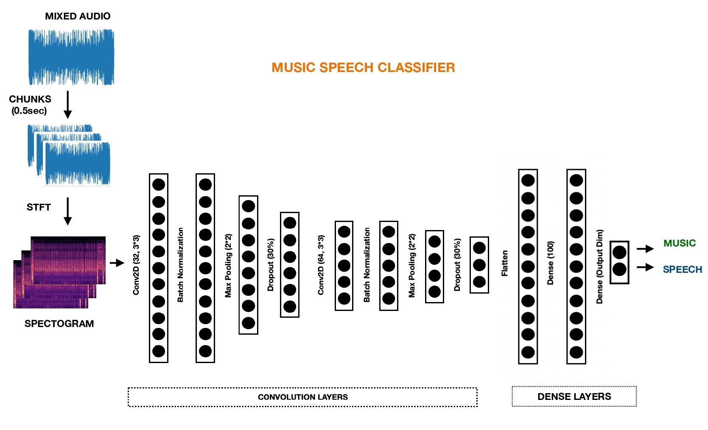

# Music-Speech-Separation


### ARCHITECTURE USED FOR TRAINING




### Usage

1. Download the pretrained model [here](https://drive.google.com/file/d/1-8ghpk711viQxyKR-acVk0_ZRrV7-hd4/view?usp=sharing)

##### Pretrained Python Code

[Python Code](MSClassifierR1.py) is used. Change the paths as required.
```
python MSClassifierR1.py
```


##### Using colab or jupyter

[Notebook](MSClassifierR1.ipynb) can be used to split the uploaded file into music and speech components. Either upload a folder or a single file.


### Training Purposes

1. [STFT based](MSClassifierV2.pynb) is the jupyter notebook/colab final version
2. [Chroma STFT based](MSClassifierV3.pynb) is the jupyter notebook/colab final version

